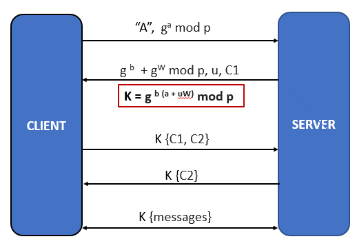

# Secure Instant Messaging Application

### Requirements

 * Python 3.10+
 * [Google Protocol Buffers v3](https://developers.google.com/protocol-buffers/docs/tutorials)

### Project Set Up

 * Install `Protocol Buffers` v3.0
    ```
     sudo apt-get update && sudo apt-get install protobuf-compiler
    ```
   
 * Compile the _.proto_ file
    ```
       protoc --python_out=. pb-team11.proto
    ```

 * Install all the dependencies

   ```commandline
      pip install -r requirements.txt
   ```
 * Provide `Execute` option to the files
   ```
      chmod 764 chat_server.py
   ```
   ```
      chmod 764 chat_client.py
   ```

 * In one terminal window run:
    ```
     ./chat_server.py -sp <SERVER_PORT>
    ```

 * In another window run:
    ```
     ./chat_client.py -sip <SERVER_IP> -sp <SERVER_PORT> -u <CLLIENT_USERNAME>
    ```

### User Credentials (for testing)

 * Username: abhiram |	Password: g0husk1e5!
 * Username: sarja | Password: g0aus11!
 * Username: simran | Password: g0MScY!	
 
### User Sign Up

 * Provide `Execute` option to the srp_credentials_creator.py file
   ```
      chmod 764 srp_credentials_creator.py
   ```

 * Generate `SRP salt` and `SRP verification key`s for a user using the below command

   ```
      ./srp_credentials_creator.py -u <username> -p <password>
   ```
   
 * Once the above program runs successfully, copy the generated credentials into `config/config.py` **entirely**

   ````
      secure_storage = {
         'username' : (SRP_salt, SRP_vkey)
      }
   ````
   * **Example:**

     

 * `Restart` the server and clients

### Commands available for the client

 * `SIGNIN`  -To authenticate to the server
 * `LIST` - To list all the available (or online) users (or clients)
 * `SEND <username> <message>` - To send a message to the user represented by the `username`
 * `BYE` - To exit the chat room

### Protocol Explanation
   * Centralized server
   * System uses KDC model, where server acts as KDC store 
   * Modified version of SRP is used for mutual authentication of server and client(s)
   * Server is assumed to be "_trusted_" by all clients
   * All the session keys, and DH components are discarded at the end of each session to provide Perfect Forward Secrecy (PFS)
   * All messages are encrypted using AES-256 in GCM mode using session keys (Hence, every message is end-to-end encrypted)

#### Between Client - Server
   
   * Modified version of Secure Remote Protocol is used to perform mutual authentication between the server and the client and establish session keys securely between them. 
   * Clients are pre-registered (already signed up)
   * Work Station on Client's side computes _W_ from user's password
   * Server knows SRP _salt and verification key_ for every user/client

      

#### Between Client - Client

   * Server provides a ticket to the destination
   * Client uses this ticket to communicate with client 2

      


### Contributors (LinkedIn)

  * [Abhiram Sarja](https://www.linkedin.com/in/asarja/) | sarja.a@northeastern.edu
  * [Simran Sohal](sohal.s@northeastern.edu) | sohal.s@northeastern.edu
